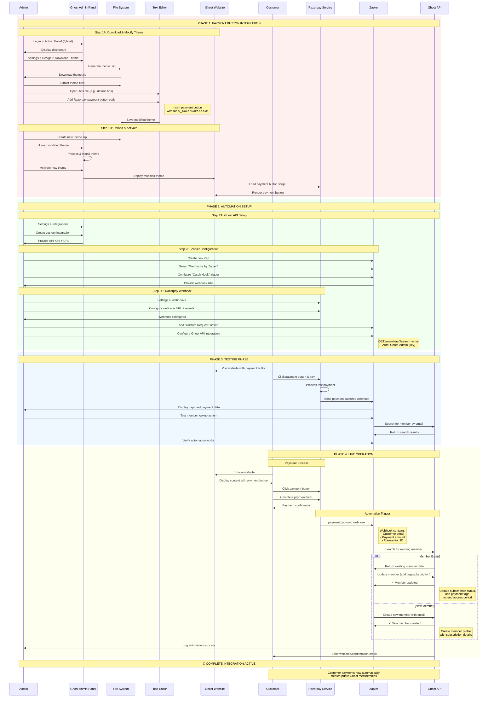

# Complete Ghost-Razorpay Integration Flow - Visual Sequence Diagram

## Complete Integration Overview

### 🏗️ **Phase 1: Payment Button Integration**
- **Download & Modify**: Admin downloads Ghost theme, adds Razorpay payment button code to theme files
- **Upload & Activate**: Modified theme is uploaded back to Ghost and activated on live website
- **Result**: Website now displays Razorpay payment button for customers

### ⚙️ **Phase 2: Automation Setup**
- **Ghost API**: Admin creates custom integration to get API credentials for member management
- **Zapier Configuration**: Admin sets up Zapier to catch webhooks and interact with Ghost API
- **Razorpay Webhook**: Admin configures Razorpay to send payment notifications to Zapier
- **Result**: Automated pipeline ready to process payments and manage memberships

### 🧪 **Phase 3: Testing Phase**
- **Test Payments**: Admin tests the complete flow with sample payments
- **Webhook Verification**: Confirms Razorpay webhooks are received by Zapier
- **API Testing**: Verifies Ghost API member operations work correctly
- **Result**: Integration tested and validated before going live

### 🚀 **Phase 4: Live Operation**
- **Customer Payment**: Real customers make payments through the integrated button
- **Automatic Processing**: Zapier receives webhook, searches/creates Ghost members
- **Member Management**: New members created automatically
- **Result**: Seamless automated membership management based on payments

## Key Benefits of Complete Integration

✅ **Seamless User Experience**: Payment button integrated directly into Ghost theme  
✅ **Automated Member Management**: No manual intervention needed for membership updates  
✅ **Real-time Processing**: Members added/updated immediately upon payment  
✅ **Scalable Solution**: Handles unlimited payments automatically  
✅ **Complete Audit Trail**: Full logging of all payments and member operations  

## Critical Success Factors

🔑 **Proper Theme Integration**: Payment button correctly embedded in theme files  
🔑 **Secure API Access**: Ghost Admin API properly configured with correct permissions  
🔑 **Reliable Webhooks**: Razorpay webhook delivery configured and tested  
🔑 **Error Handling**: Zapier automation includes retry logic and error notifications  
🔑 **Testing Validation**: Complete end-to-end testing before production deployment  

