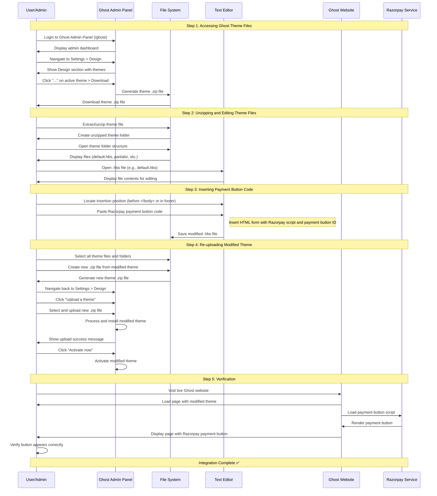

# Ghost Theme Payment Button Integration - Sequence Diagram

## Key Interactions Summary

1. **Theme Download**: User accesses Ghost admin panel and downloads the current active theme as a .zip file
2. **Local Modification**: User extracts the theme, opens .hbs files in a text editor, and inserts the Razorpay payment button code
3. **Theme Upload**: User re-zips the modified theme and uploads it back to Ghost admin panel
4. **Activation**: User activates the new modified theme
5. **Verification**: The live website now displays the integrated Razorpay payment button

## Critical Points
- The payment button ID (`pl_XXxXX6XxXXXXxx`) must be replaced with the actual Razorpay payment button ID
- Proper .zip file structure is crucial - theme files should be at the root level of the .zip, not in a nested folder
- The button placement location determines where it appears on the website (footer, header, or specific pages)
