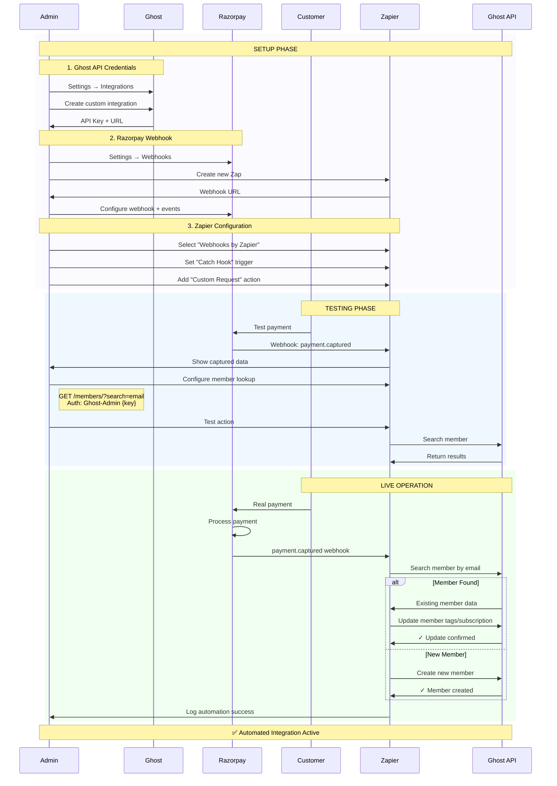

# Ghost-Razorpay-Zapier Integration - Sequence Diagram

## Key Interactions Summary

### Initial Setup Phase
1. **Ghost API Setup**: Admin creates custom integration in Ghost to get API credentials
2. **Razorpay Webhook Configuration**: Admin configures Razorpay to send payment notifications to Zapier
3. **Zapier Zap Creation**: Admin creates automated workflow to catch Razorpay webhooks and interact with Ghost API
4. **Testing**: Admin tests the integration with sample payments

### Runtime Automation Phase
1. **Payment Trigger**: Customer makes payment through Razorpay
2. **Webhook Delivery**: Razorpay sends payment notification to Zapier
3. **Member Lookup**: Zapier searches Ghost for existing member using payment email
4. **Member Management**: Zapier either updates existing member or creates new member in Ghost
5. **Completion**: Automated membership management based on successful payments

## Critical Components

- **Ghost Admin API**: Provides programmatic access to member management
- **Razorpay Webhooks**: Real-time payment notifications 
- **Zapier Integration**: No-code automation platform connecting Razorpay and Ghost
- **Authentication**: Secure API key-based authentication for Ghost Admin API
- **Error Handling**: Built-in retry mechanisms and error logging in Zapier

## Benefits

- **Automated Membership**: No manual intervention needed for member creation/updates
- **Real-time Processing**: Members are added immediately upon successful payment
- **Scalable Solution**: Handles high volume of payments automatically
- **Audit Trail**: Complete log of all automation activities in Zapier
